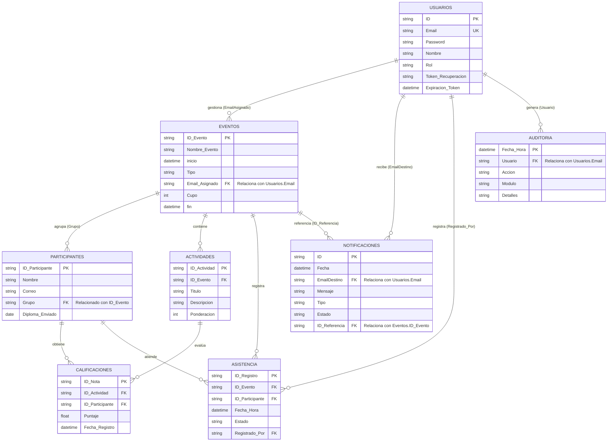

```mermaid
erDiagram
    USUARIOS ||--o{ EVENTOS : "gestiona (EmailAsignado)"
    USUARIOS ||--o{ NOTIFICACIONES : "recibe (EmailDestino)"
    USUARIOS ||--o{ ASISTENCIA : "registra (Registrado_Por)"
    USUARIOS ||--o{ AUDITORIA : "genera (Usuario)"

    EVENTOS ||--o{ PARTICIPANTES : "agrupa (Grupo)"
    EVENTOS ||--o{ ACTIVIDADES : "contiene"
    EVENTOS ||--o{ ASISTENCIA : "registra"
    EVENTOS ||--o{ NOTIFICACIONES : "referencia (ID_Referencia)"
    
    PARTICIPANTES ||--o{ CALIFICACIONES : "obtiene"
    PARTICIPANTES ||--o{ ASISTENCIA : "atiende"
    
    ACTIVIDADES ||--o{ CALIFICACIONES : "evalúa"
    
    USUARIOS {
        string ID PK
        string Email UK
        string Password
        string Nombre
        string Rol
        string Token_Recuperacion
        datetime Expiracion_Token
    }

    EVENTOS {
        string ID_Evento PK
        string Nombre_Evento
        datetime inicio
        string Tipo
        string Email_Asignado FK "Relaciona con Usuarios.Email"
        int Cupo
        datetime fin
    }
PARTICIPANTES {
        string ID_Participante PK
        string Nombre
        string Correo
        string Grupo FK "Relacionado con ID_Evento"
        date Diploma_Enviado
    }

ACTIVIDADES {
        string ID_Actividad PK
        string ID_Evento FK
        string Titulo
        string Descripcion
        int Ponderacion
    }

    CALIFICACIONES {
        string ID_Nota PK
        string ID_Actividad FK
        string ID_Participante FK
        float Puntaje
        datetime Fecha_Registro
    }

    ASISTENCIA {
        string ID_Registro PK
        string ID_Evento FK
        string ID_Participante FK
        datetime Fecha_Hora
        string Estado
        string Registrado_Por FK
    }

    NOTIFICACIONES {
        string ID PK
        datetime Fecha
        string EmailDestino FK "Relaciona con Usuarios.Email"
        string Mensaje
        string Tipo
        string Estado
        string ID_Referencia FK "Relaciona con Eventos.ID_Evento"
    }

    AUDITORIA {
        datetime Fecha_Hora PK
        string Usuario FK "Relaciona con Usuarios.Email"
        string Accion
        string Modulo
        string Detalles
    }
```
