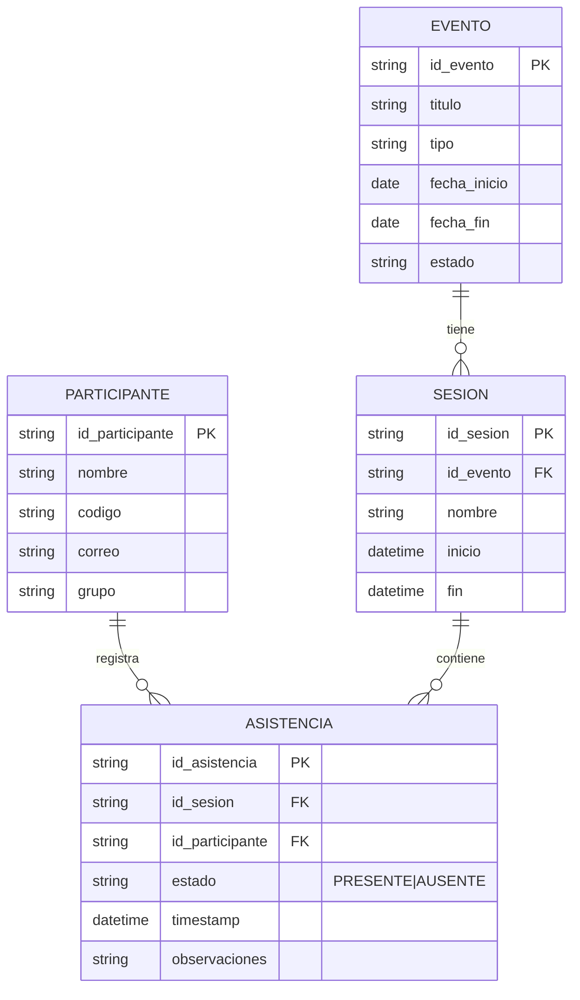

```mermaid
erDiagram
  EVENTO ||--o{ SESION : tiene
  PARTICIPANTE ||--o{ ASISTENCIA : registra
  SESION ||--o{ ASISTENCIA : contiene

  EVENTO {
    string id_evento PK
    string titulo
    string tipo
    date fecha_inicio
    date fecha_fin
    string estado
  }

  SESION {
    string id_sesion PK
    string id_evento FK
    string nombre
    datetime inicio
    datetime fin
  }

  PARTICIPANTE {
    string id_participante PK
    string nombre
    string codigo
    string correo
    string grupo
  }

  ASISTENCIA {
    string id_asistencia PK
    string id_sesion FK
    string id_participante FK
    string estado  "PRESENTE|AUSENTE"
    datetime timestamp
    string observaciones
  }
```
